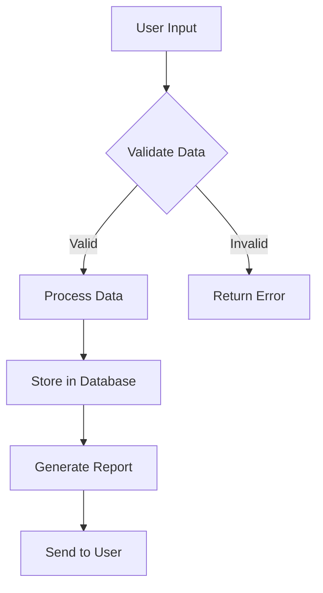
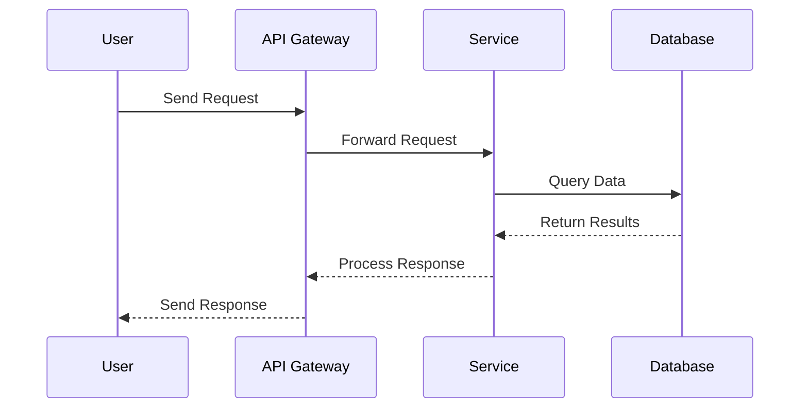
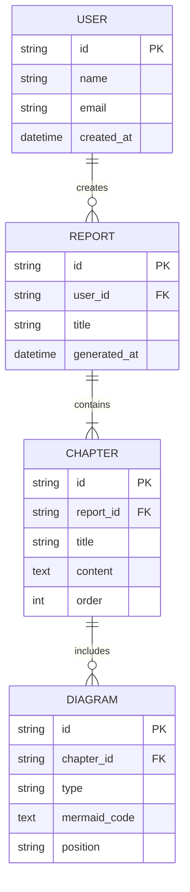
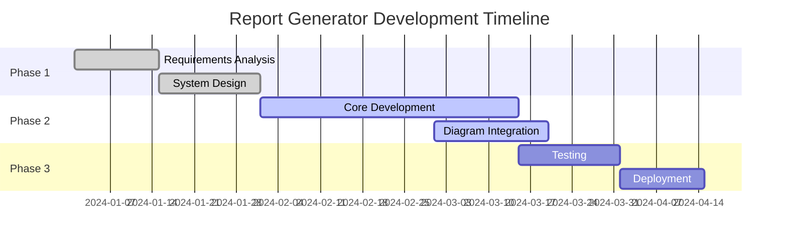
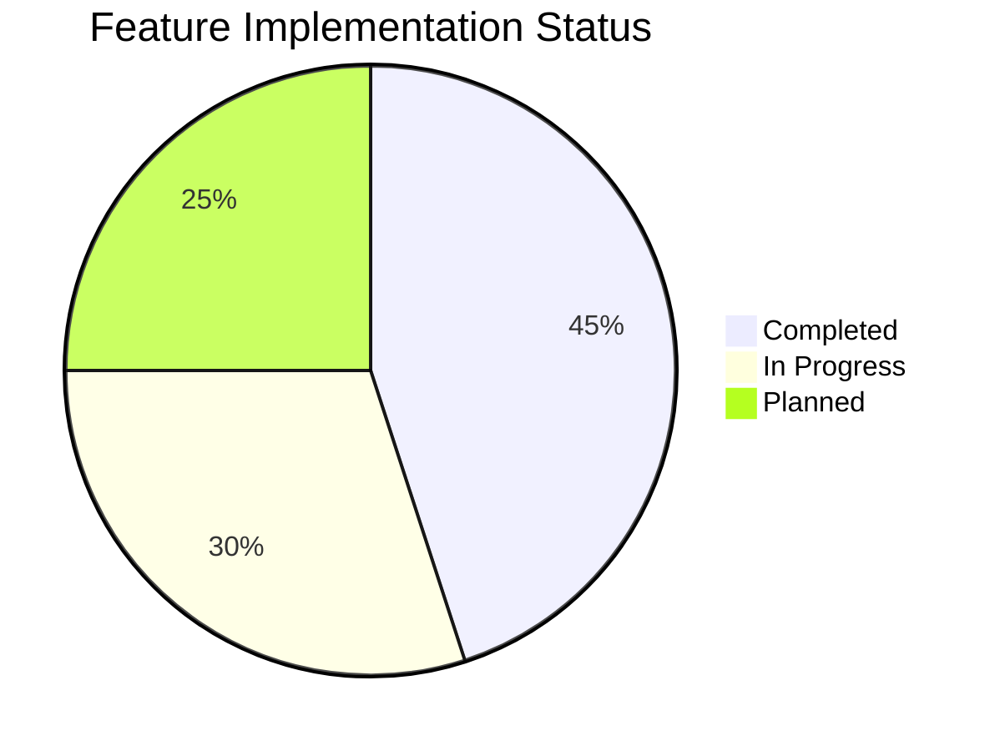
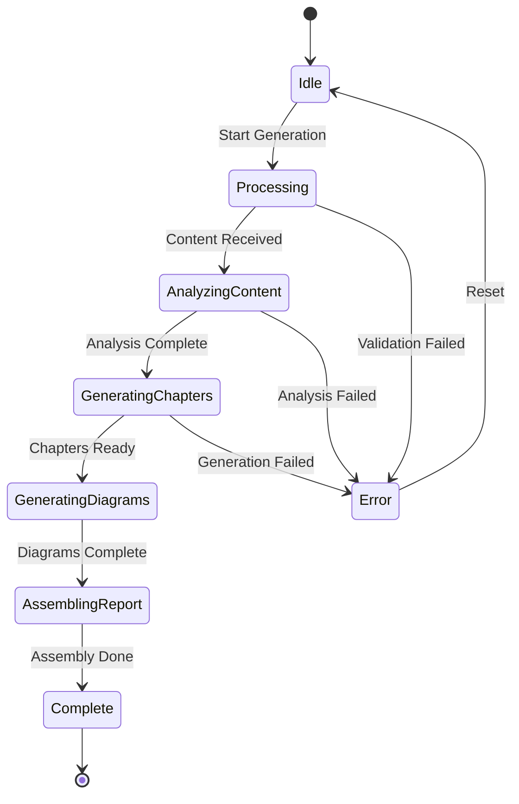

# Test Report with Mermaid Diagrams

This is a test document to verify that Mermaid diagrams render correctly in markdown.

## Chapter 1: System Architecture

### Overview

This chapter demonstrates various types of Mermaid diagrams integrated into a report.

### System Flow

Here's how our system processes data:

### Data Flow Diagram

*This diagram illustrates the main data processing flow in our system*

### Component Interaction

The following sequence diagram shows how components interact:

### API Interaction Sequence

*Sequence of API calls in our microservices architecture*

### Database Schema

Our data model is structured as follows:

### Entity Relationship Diagram

*Database schema for the report generation system*

## Chapter 2: Project Timeline

### Project Phases

Here's our development timeline:

### Development Gantt Chart

*Project development timeline with key milestones*

### Feature Distribution

Current feature implementation status:

### Implementation Status

*Distribution of features across implementation stages*

## Chapter 3: Technical Analysis

### System States

The report generation workflow has several states:

### Workflow State Diagram

*State transitions in the report generation workflow*

---

This test document demonstrates how Mermaid diagrams can be seamlessly integrated into markdown reports, providing visual clarity to complement textual content.